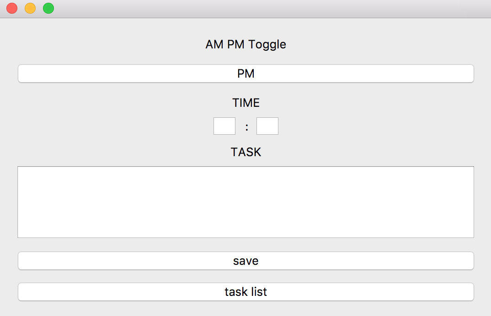
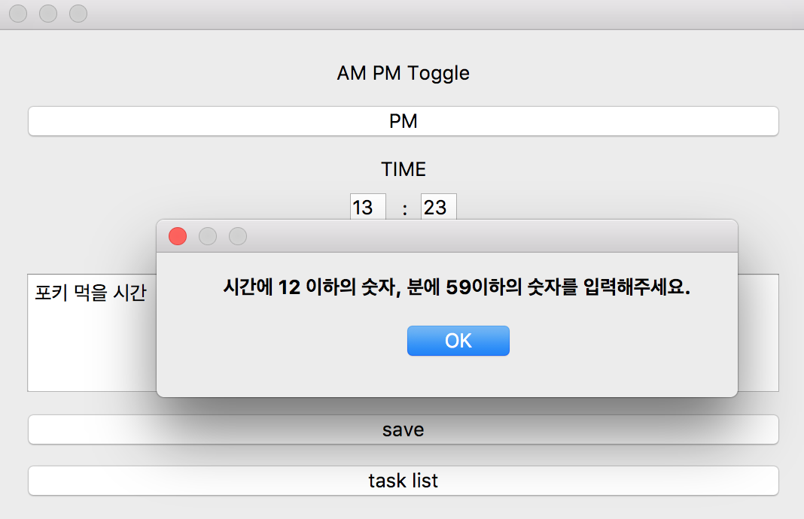
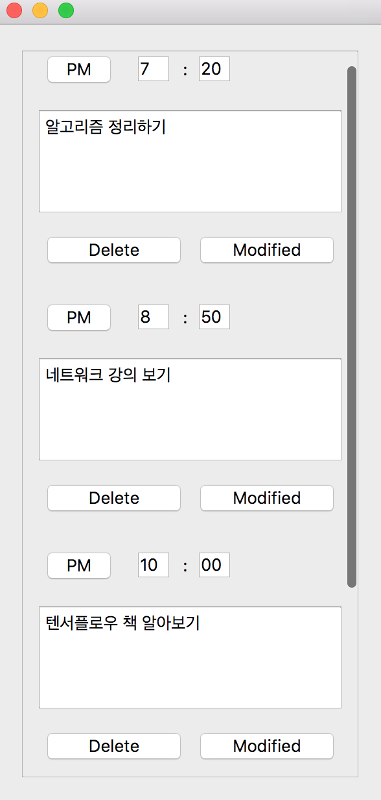
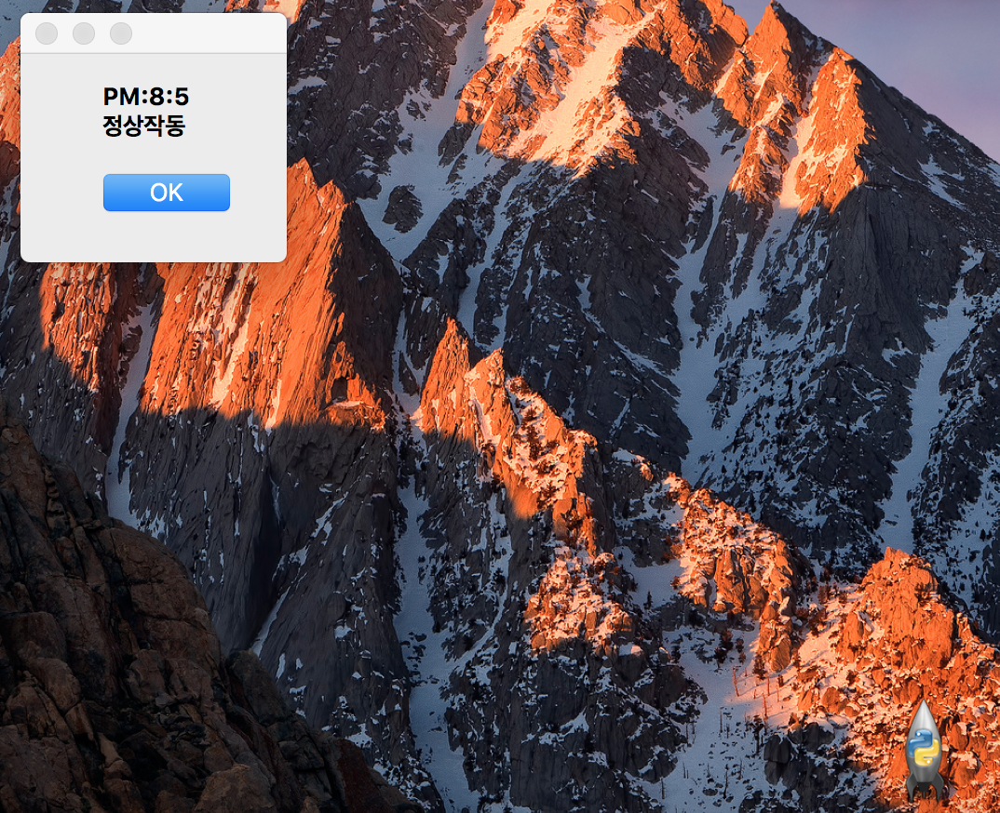

# DayManagement

### 1. 메인화면

#### 1.AM PM Toggle
- AM 또는 PM으로 시간을 설정합니다. 클릭하면 AM 바뀝니다.
	- 토글을 만든 이유는 직관성을 높이기 위해서이다 15시 17시라고 하면 한 번 생각하고 '아 몇 시구나' 라고 생각하기 때문에 토글을 만들었다. 

#### 2. TIME
- 시간을 설정합니다. 시간은 11 이하의 숫자, 분은 59 이하의 숫자만 입력 가능합니다. 만약 그 이상의 수를 입력하면 오류 메시지가 출력됩니다.
- 

#### 3. TASK
- 해야 할 일을 입력합니다 

#### 4. SAVE
- 시간과 해야 할 일을 입력하고 저장합니다

#### 5. task list
- 해야할 일들의 목록을 보여줍니다
- 
	- Delete
		- 할 일을 삭제하고 시간 순서대로 재정렬 합니다.
	- Modified
		- 할 일을 수정 하고시간 순서대로 재정렬 합니다.

#### 6. 알람

1. 
	- 아이콘이 화면 아래에서 튀어 오릅니다.

 
